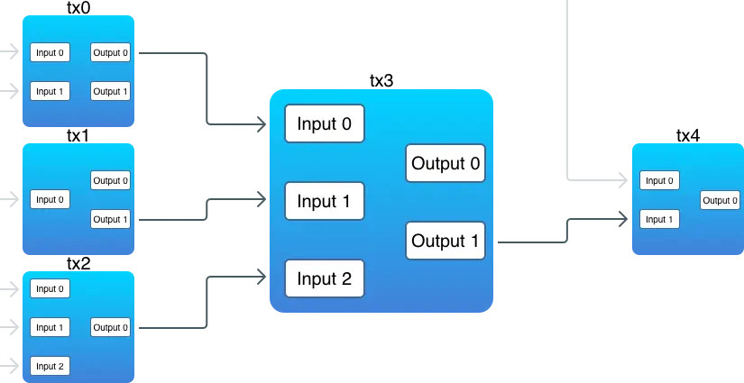

# 交易
交易（transaction）是比特币的核心所在，而区块链唯一的目的，也正是为了能够安全可靠地存储交易。在区块链中，交易一旦被创建，就没有任何人能够再去修改或是删除它。

由于比特币采用的是 UTXO 模型，并非账户模型，并不直接存在“余额”这个概念，余额需要通过遍历整个交易历史得来。

一笔交易由一些输入（input）和输出（output）组合而来：
```go
type Transaction struct {
    ID   []byte
    Vin  []TXInput
    Vout []TXOutput
}
```
- 对于每一笔新的交易，它的输入会引用（reference）之前一笔交易的输出（这里有个例外，coinbase 交易），引用就是花费的意思。
- 所谓引用之前的一个输出，也就是将之前的一个输出包含在另一笔交易的输入当中，就是花费之前的交易输出。交易的输出，就是币实际存储的地方。 

下面的图示阐释了交易之间的互相关联:

需要注意的点：
1. 有一些输出并没有被关联到某个输入上
2. 一笔交易的输入可以引用之前多笔交易的输出 
3. 一个输入必须引用一个输出

在比特币中，其实并不存在这样的概念。交易仅仅是通过一个脚本（script）来锁定（lock）一些值（value），而这些值只可以被锁定它们的人解锁（unlock）。
每一笔比特币交易都会创造输出，输出都会被区块链记录下来。给某个人发送比特币，实际上意味着创造新的 UTXO 并注册到那个人的地址，可以为他所用。
